# 🎓 CampusFlow

<p align="center">
  <strong>A Full-Stack Campus Complaint Management System</strong>
</p>

<p align="center">
  Report • Track • Manage • Resolve
</p>

<p align="center">

**React + TypeScript** • **Node.js + Express** • **MongoDB** • **JWT Authentication**

</p>

---

## 📌 Overview

**CampusFlow** is a full-stack campus complaint management platform designed to simplify the process of reporting, tracking, reviewing, and resolving campus-related complaints.

The system provides dedicated experiences for **students** and **administrators**.

Students can securely register, log in, submit complaints, track their complaints, and view complaint details.

Administrators can review complaints submitted across the campus, identify the student who raised each complaint, search and filter complaints, update complaint statuses, add administrative remarks, and monitor complaint statistics.

The goal of CampusFlow is to provide a **centralized, transparent, and efficient complaint management workflow** for educational institutions.

---

## 🚀 Live Application

**Frontend:**  
https://campusflow-frontend-green.vercel.app/

**Backend API:**  
https://campusflow-yubf.onrender.com/api

---

# ✨ Key Features

## 👨‍🎓 Student Features

- 🔐 Secure student authentication
- 📝 Submit new complaints
- 🏷️ Categorize complaints
- 📍 Specify complaint location
- ⚡ Set complaint priority
- 📋 View submitted complaints
- 🔎 Search and filter complaints
- 📊 Track complaint status
- 👤 View and manage profile information
- 🔔 User-friendly feedback and toast notifications
- 📱 Responsive dashboard interface

### Complaint Categories

- Academic
- Facilities
- Hostel
- Mess
- Transport
- Technical
- Other

### Complaint Priorities

- Low
- Medium
- High

### Complaint Status

- Pending
- In Progress
- Resolved

---

## 👨‍💼 Administrator Features

- 🔐 Role-based administrator access
- 📊 Admin dashboard
- 📋 View all campus complaints
- 👤 View the student who raised each complaint
- 🔎 Search complaints by title or student
- 🏷️ Filter complaints by category
- 📌 Filter complaints by status
- ⚡ View complaint priority
- 📝 Update complaint status
- 💬 Add administrative remarks
- 📈 View complaint statistics
- 📅 View complaint submission dates
- 🔍 Open detailed complaint information

---

# 🏗️ System Architecture

CampusFlow follows a modern **client-server architecture** where the React frontend communicates with the Node.js and Express backend through REST APIs.

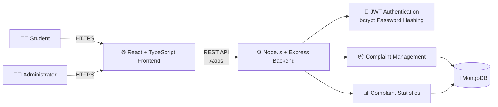

### Architecture Components

| Layer | Technology | Responsibility |
|---|---|---|
| Presentation | React + TypeScript | User interface and dashboards |
| Routing | React Router | Page navigation and protected routes |
| Styling | Tailwind CSS | Responsive UI design |
| API Client | Axios | Frontend-backend communication |
| Backend | Node.js + Express | REST API and business logic |
| Authentication | JWT + bcrypt | Secure authentication and authorization |
| Database | MongoDB + Mongoose | Persistent data storage |
| Deployment | Vercel + Render | Production hosting |

---

# 🔐 Authentication Flow

CampusFlow uses JWT-based authentication with protected routes and role-based access control.

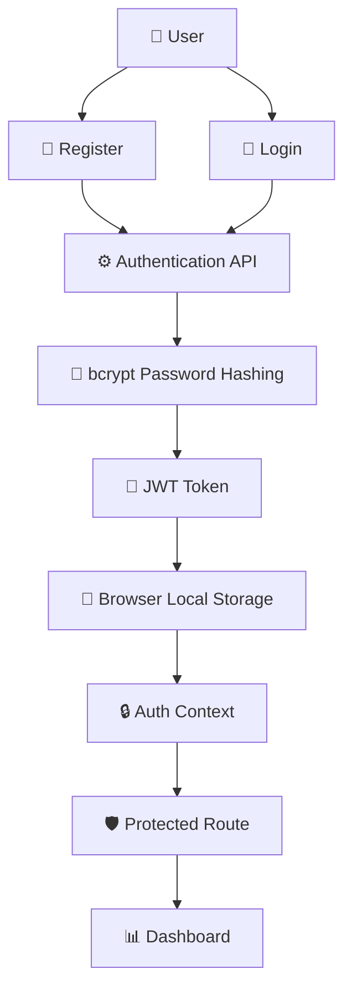

### Authentication Process

1. User registers or logs in.
2. Backend validates the credentials.
3. Passwords are securely handled using bcrypt.
4. Backend generates a JWT token.
5. Frontend stores the authentication token.
6. Axios automatically attaches the token to protected API requests.
7. Protected routes verify the authenticated user.
8. Role-based routes restrict administrator-only functionality.

---

# 👨‍🎓 Student Complaint Flow

The student complaint workflow starts from authentication and ends with tracking the complaint status.

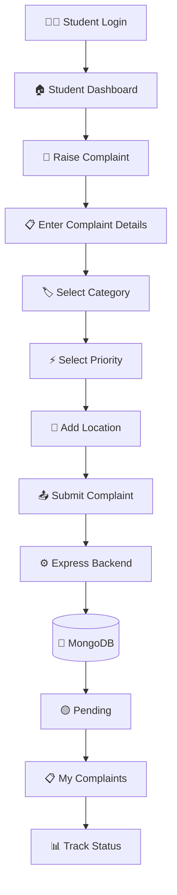

---

# 👨‍💼 Administrator Complaint Management Flow

Administrators can review all complaints and manage their status.

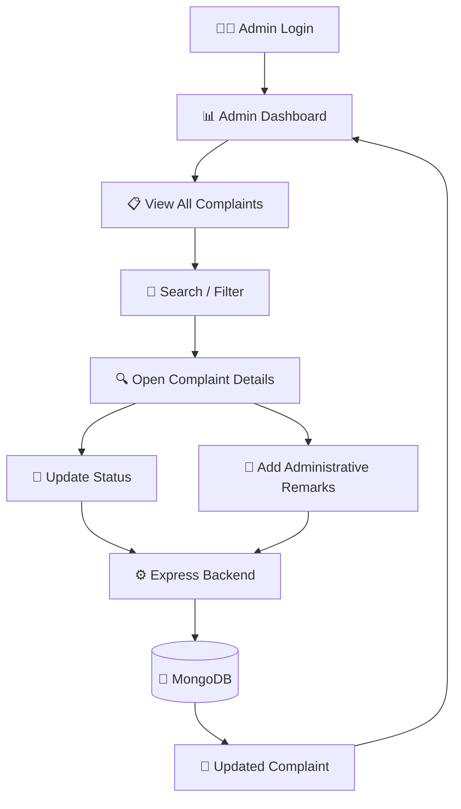

---

# 🔄 Complaint Lifecycle

Every complaint follows a controlled status lifecycle.

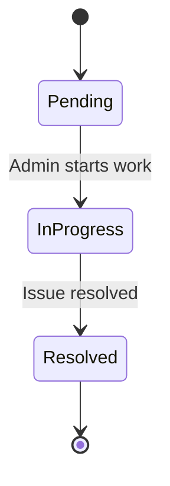

### Complaint Status Meaning

| Status | Meaning |
|---|---|
| 🟡 Pending | Complaint has been submitted and is awaiting action |
| 🔵 In Progress | Administrator is working on the complaint |
| 🟢 Resolved | Complaint has been addressed and completed |

---

# 🌐 API Request Flow

Frontend requests are handled through Axios and protected backend routes.

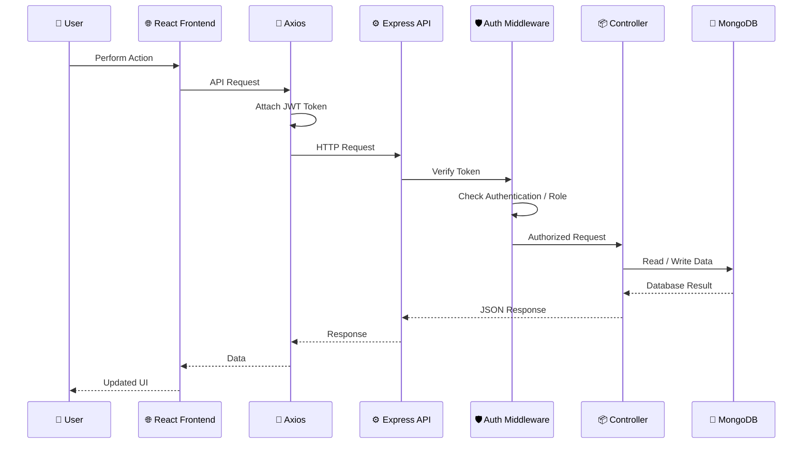

---

# 🗄️ Database ER Diagram

The main relationship in CampusFlow connects users/students with their submitted complaints.

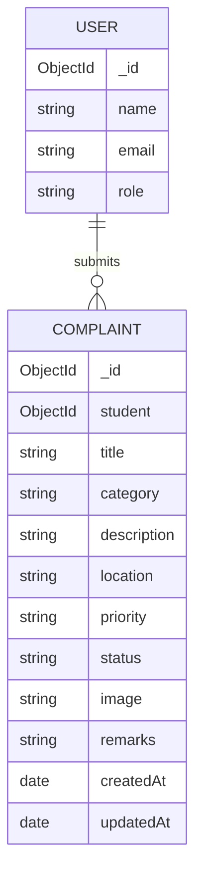

### Complaint Data Model

A complaint contains:

- Student reference
- Title
- Category
- Description
- Location
- Priority
- Status
- Image field
- Administrative remarks
- Creation timestamp
- Last updated timestamp

---

# 🚀 Deployment Architecture

The production application separates frontend hosting, backend hosting, and database services.

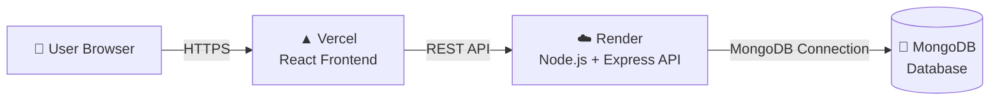

### Production Architecture

```text
User
  │
  │ HTTPS
  ▼
Vercel
  │
  │ REST API
  ▼
Render
  │
  │ MongoDB Connection
  ▼
MongoDB
```

---

# 📡 REST API

The backend exposes RESTful endpoints for authentication and complaint management.

## Complaint APIs

| Method | Endpoint | Access | Purpose |
|---|---|---|---|
| `POST` | `/api/complaints` | Student | Create a complaint |
| `GET` | `/api/complaints/my` | Authenticated User | Get user's complaints |
| `GET` | `/api/complaints` | Admin | Get all complaints |
| `GET` | `/api/complaints/stats` | Admin | Get complaint statistics |
| `PUT` | `/api/complaints/:id` | Admin | Update complaint status / remarks |

## Authentication

Authentication routes are grouped under:

```text
/api/auth
```

The authentication layer handles user registration, login, JWT generation, and authenticated user access.

---

# 📊 Admin Dashboard

The administrator dashboard provides an overview of complaint activity.

### Dashboard Statistics

- Total complaints
- Pending complaints
- In Progress complaints
- Resolved complaints

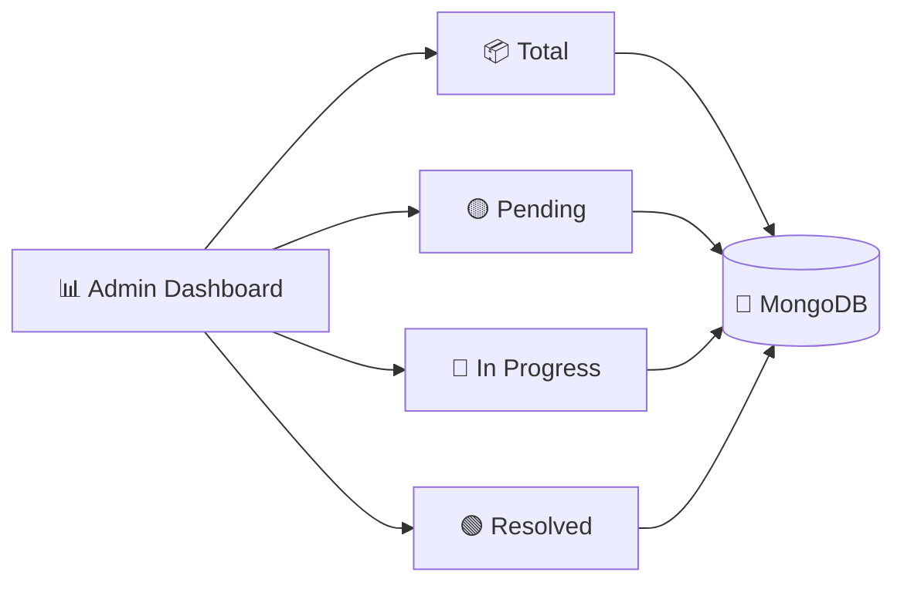

---

# 🔎 Complaint Search & Filtering

Administrators can efficiently locate complaints using:

- 🔎 Search by complaint title
- 👤 Search by student
- 🏷️ Filter by category
- 📌 Filter by status
- ⚡ View priority
- 📅 View submission date
- 🔍 Open detailed complaint information

This allows administrators to quickly identify and manage specific complaints.

---

# 🛡️ Security

CampusFlow implements several security mechanisms.

### Authentication

- JWT-based authentication
- Secure password hashing using bcrypt
- Authorization header for protected requests
- Authentication state management on the frontend

### Authorization

- Protected student routes
- Protected administrator routes
- Role-based access control
- Admin-only complaint management endpoints

### Backend Protection

- Express middleware
- Authentication middleware
- Admin authorization middleware
- Mongoose validation
- CORS configuration
- Environment-based secrets

---

# 🧩 Project Structure

The repository follows a separated frontend-backend structure.

```text
CampusFlow/
│
├── client/
│   │
│   ├── src/
│   │   ├── components/
│   │   ├── context/
│   │   ├── lib/
│   │   ├── pages/
│   │   └── types/
│   │
│   ├── public/
│   ├── package.json
│   └── vite.config.*
│
├── server/
│   │
│   ├── config/
│   │   └── db.js
│   │
│   ├── controllers/
│   │   ├── authController.js
│   │   └── complaintController.js
│   │
│   ├── middleware/
│   │   └── authMiddleware.js
│   │
│   ├── models/
│   │   ├── User.js
│   │   └── Complaint.js
│   │
│   ├── routes/
│   │   ├── authRoutes.js
│   │   └── complaintRoutes.js
│   │
│   ├── server.js
│   └── package.json
│
└── README.md
```

---

# 🖥️ Main Application Pages

## Public Pages

- Landing Page
- Student Login
- Administrator Login
- Registration

## Student Pages

- Student Dashboard
- Raise Complaint
- My Complaints
- Profile

## Administrator Pages

- Admin Dashboard
- All Complaints
- Complaint Details
- Complaint Management

---

# 🛠️ Technology Stack

## Frontend

| Technology | Purpose |
|---|---|
| React | UI development |
| TypeScript | Type-safe frontend development |
| Vite | Frontend build tool |
| Tailwind CSS | Styling and responsive design |
| React Router | Client-side routing |
| Axios | API communication |
| Lucide React | UI icons |
| React Hot Toast | User feedback |
| Recharts | Dashboard statistics |

## Backend

| Technology | Purpose |
|---|---|
| Node.js | JavaScript runtime |
| Express.js | REST API framework |
| Mongoose | MongoDB object modeling |
| JWT | Authentication |
| bcryptjs | Password hashing |
| CORS | Cross-origin communication |
| dotenv | Environment configuration |

## Database

**MongoDB**

Used for storing:

- Users
- Complaints
- Complaint status
- Complaint priority
- Administrative remarks
- Timestamps

## Deployment

| Service | Purpose |
|---|---|
| Vercel | Frontend deployment |
| Render | Backend deployment |
| MongoDB | Database |

---

# ⚙️ Environment Variables

## Backend

Create a `.env` file inside the `server` directory.

```env
PORT=5000
MONGO_URI=your_mongodb_connection_string
JWT_SECRET=your_jwt_secret
```

> Never commit `.env` files or secret credentials to GitHub.

## Frontend

The frontend can use:

```env
VITE_API_URL=your_backend_api_url/api
```

If `VITE_API_URL` is not provided, the application can use its configured backend API URL.

---

# 🚀 Local Development

## 1. Clone the Repository

```bash
git clone https://github.com/Naveenbabu45/CampusFlow.git
cd CampusFlow
```

---

## 2. Setup Backend

```bash
cd server
npm install
```

Configure the `.env` file and start the backend:

```bash
node server.js
```

The backend runs on:

```text
http://localhost:5000
```

---

## 3. Setup Frontend

Open another terminal:

```bash
cd client
npm install
npm run dev
```

The Vite development server will provide the local frontend URL.

---

# 🔁 Development Workflow

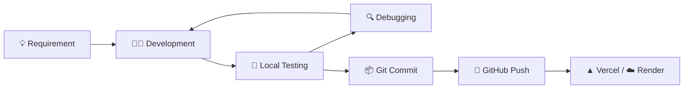

---

# 🧪 Complaint Management Workflow

The complete complaint management process can be summarized as:

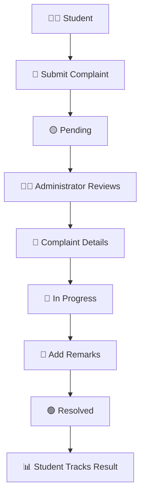

---

# 🎯 Project Goals

CampusFlow was developed with the following goals:

### 1. Centralized Complaint Management

Provide a single platform where students can submit and track complaints.

### 2. Administrative Efficiency

Allow administrators to manage complaints from a centralized dashboard.

### 3. Transparency

Give students visibility into the current status of their complaints.

### 4. Structured Complaint Handling

Organize complaints using:

- Categories
- Priorities
- Statuses
- Submission dates
- Administrative remarks

### 5. Secure Access

Ensure that users only access functionality appropriate to their role.

---

# 💡 What This Project Demonstrates

CampusFlow demonstrates practical full-stack development concepts including:

- React application development
- TypeScript
- Component-based architecture
- Client-side routing
- Protected routes
- Context-based authentication
- Axios API integration
- REST API development
- Express middleware
- JWT authentication
- Role-based authorization
- Password hashing
- MongoDB data modeling
- Mongoose schemas
- CRUD operations
- Search and filtering
- Dashboard statistics
- Error handling
- Environment configuration
- Vercel deployment
- Render deployment
- Git and GitHub workflow

---

# 📈 Future Enhancements

Potential future improvements include:

- 📎 Complaint attachment support
- 🔔 Real-time complaint notifications
- 📧 Email notifications
- 📝 Complaint history timeline
- 👨‍💼 Complaint assignment to specific administrators
- 📊 Advanced analytics
- 📅 SLA and resolution-time tracking
- 📱 Improved mobile-specific layouts
- 🌙 Dark mode
- 📄 Complaint report export
- 🔍 Advanced filtering and sorting
- 🧾 Audit logs

---

# 🏆 Project Highlights

### Full-Stack Architecture

Frontend and backend are separated into independently manageable layers.

### Role-Based Access

Students and administrators receive different application experiences and permissions.

### Secure Authentication

JWT authentication and bcrypt password hashing are used to protect user accounts.

### RESTful Backend

The Express backend exposes structured REST API endpoints for complaint management.

### Database Integration

MongoDB provides persistent storage for users and complaints.

### Production Deployment

The project is deployed using:

```text
Frontend → Vercel
Backend  → Render
Database → MongoDB
```

---

# 📊 System Summary

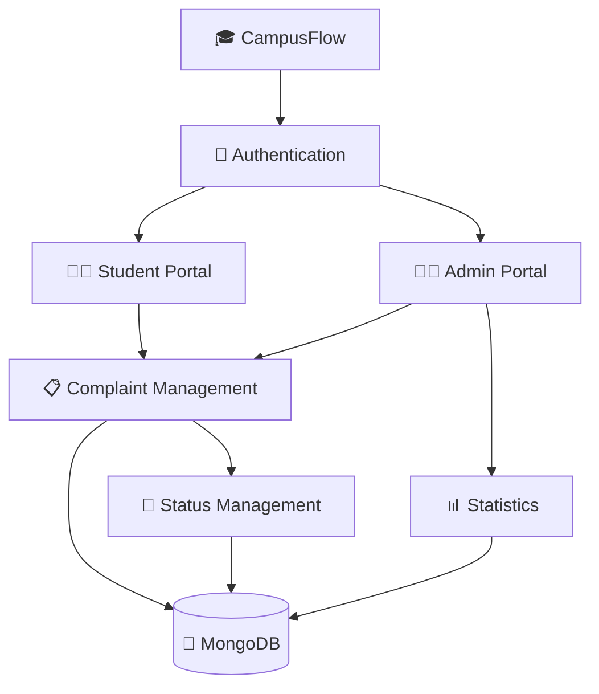

---

# 📌 Current Project Status

| Module | Status |
|---|---|
| Student Registration | ✅ Completed |
| Student Login | ✅ Completed |
| Admin Login | ✅ Completed |
| JWT Authentication | ✅ Completed |
| Role-Based Authorization | ✅ Completed |
| Student Dashboard | ✅ Completed |
| Raise Complaint | ✅ Completed |
| My Complaints | ✅ Completed |
| Admin Dashboard | ✅ Completed |
| View All Complaints | ✅ Completed |
| Search & Filtering | ✅ Completed |
| Complaint Status Updates | ✅ Completed |
| Administrative Remarks | ✅ Completed |
| Complaint Statistics | ✅ Completed |
| MongoDB Integration | ✅ Completed |
| Production Frontend | ✅ Deployed |
| Production Backend | ✅ Deployed |

---

# 👨‍💻 Author

**Naveen Babu**

Computer Science & Engineering

Full-Stack Development • React • Node.js • MongoDB

---

# 📄 License

This project is currently provided for **educational and portfolio purposes**.

---

# ⭐ Final Note

CampusFlow was built to demonstrate how a real-world campus complaint workflow can be transformed into a centralized full-stack web application.

The project combines:

**Modern Frontend Development + REST APIs + Authentication + Database Management + Role-Based Access + Cloud Deployment**

into one complete application.

---

<p align="center">
  <strong>🎓 CampusFlow</strong>
</p>

<p align="center">
  Report • Track • Manage • Resolve
</p>
